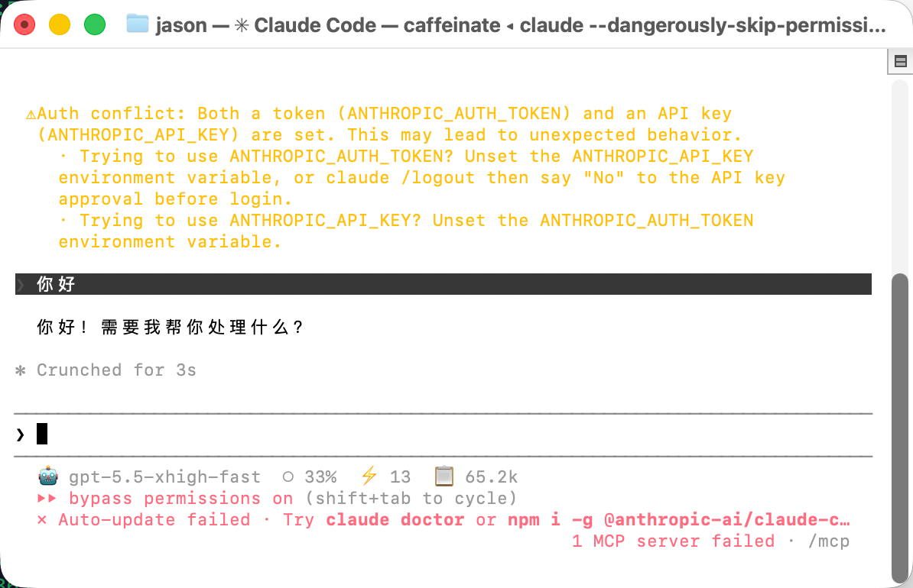
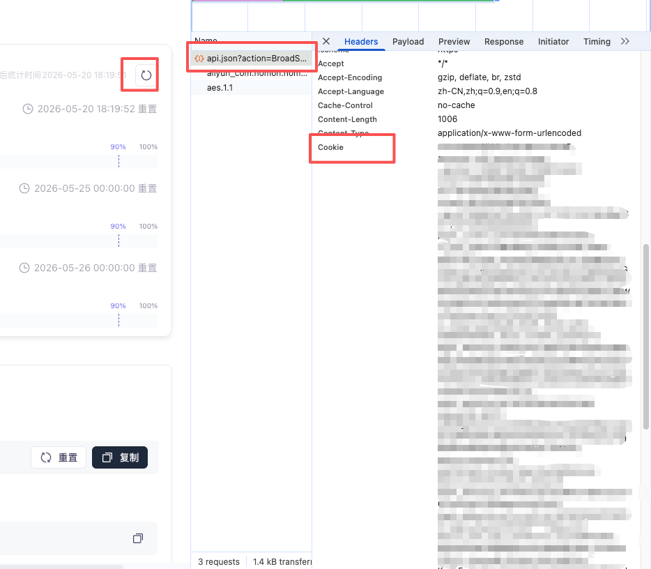
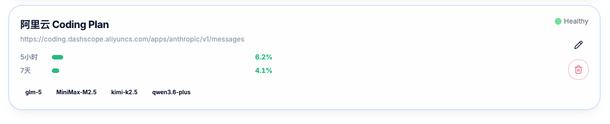

**[🇨🇳 中文文档](README.md)**  |  **[🇬🇧 English](README_en.md)**  |  [](https://www.npmjs.com/package/@wengine-ai/claude-code-router-next)

> **Note**: The original [claude-code-router](https://github.com/musistudio/claude-code-router) repository is no longer actively maintained. This project is a community-driven fork that continues to be actively developed and maintained with bug fixes, new features, and ongoing improvements.

<hr>

> [Progressive Disclosure of Agent Tools from the Perspective of CLI Tool Style](/blog/en/progressive-disclosure-of-agent-tools-from-the-perspective-of-cli-tool-style.md)

> A powerful tool to route Claude Code and Codex requests to different models and customize any request.



## ✨ Features

- **Model Routing**: Route requests to different models based on your needs (e.g., background tasks, thinking, long context).
- **Multi-Provider Support**: Supports various model providers like OpenRouter, DeepSeek, Ollama, Gemini, Volcengine, and SiliconFlow.
- **Request/Response Transformation**: Customize requests and responses for different providers using transformers.
- **Dynamic Model Switching**: Switch models on-the-fly within Claude Code using the `/model` command.
- **CLI Model Management**: Manage models and providers directly from the terminal with `ccr model`.
- **GitHub Actions Integration**: Trigger Claude Code tasks in your GitHub workflows.
- **Usage Statistics & Quota Monitoring**: Tracks tokens, cache hits, Time to First Token (TTFT), and generation speed (tokens/sec) for each request, with real-time tracking of quotas and reset times for major providers.
- **Plugin System**: Extend functionality with custom transformers.

## 🚀 Getting Started

### 1. Installation

You can install Claude Code Router either from the npm registry or directly from this GitHub repository for the latest development version.

#### Option A: Install from npm registry (Stable)

First, ensure you have [Claude Code](https://docs.anthropic.com/en/docs/claude-code/quickstart) installed:

```shell
npm install -g @anthropic-ai/claude-code
```

Then, install Claude Code Router:

```shell
npm install -g @wengine-ai/claude-code-router-next
```

#### Option B: Install from GitHub (Latest Development Version)

If you want to use the latest features and bug fixes directly from the source code:

1. **Uninstall the current version first** (to prevent command conflicts):
   ```shell
   npm uninstall -g @wengine-ai/claude-code-router-next @musistudio/claude-code-router @wengine-ai/claude-code-router
   ```

2. **Clone and link locally** (recommended for developers):
   ```shell
   git clone https://github.com/xiaoliu10/claude-code-router-next.git
   cd claude-code-router-next
   pnpm install
   pnpm build
   npm link
   ```

   *Alternatively, install directly from GitHub globally:*
   ```shell
   npm install -g github:xiaoliu10/claude-code-router-next
   ```

#### 🔄 Migrating from the Official Upstream (@musistudio/claude-code-router)

If you are currently using the upstream community version `@musistudio/claude-code-router` or the previous version `@wengine-ai/claude-code-router` and want to switch to `@wengine-ai/claude-code-router-next`:

1. **Uninstall the old version**:
   ```shell
   npm uninstall -g @musistudio/claude-code-router @wengine-ai/claude-code-router
   ```

2. **Install this version**:
   ```shell
   npm install -g @wengine-ai/claude-code-router-next
   ```

> **Note**: Your existing configuration at `~/.claude-code-router/config.json` is **not affected** by uninstalling the old package. The new version will automatically read your existing configuration.

### Upgrade

```shell
npm install -g @wengine-ai/claude-code-router-next@latest && ccr restart
```

### 📅 Changelog (Release History)

| Version | Release Details |
| --- | --- |
| **v2.3.236** | <ul><li>**Aliyun Token Plan quota (5h/7d)**: Adds a dedicated `AliyunTokenPlanQuotaAdapter` for `*.maas.aliyuncs.com` hosts, querying the Token Plan usage API via BroadScope POST and mapping `per5HourPercentage`/`per1WeekPercentage` to 5h/7d percentage display.</li><li>**`quota_sec_token` config + official gateway with legacy fallback**: Optional `quota_sec_token` provider field and UI password input switch to the official `bailian-cs.console.aliyun.com` gateway (aligned with the real console request: literal `_v=undefined`, dynamic trace, no spm), falling back to the cookie-only `cs-data` endpoint on failure.</li><li>**pi extended-context unified to absolute threshold**: Drops pi's `extendedContextRatio` in favor of the shared absolute chain (family → Router → 200000).</li><li>**Test HOME isolation now reaches vitest workers**: Fixes the core/shared suites previously running against the real `~/.claude-code-router`.</li></ul> |
| **v2.3.235** | <ul><li>**Fix npm global installation failing silently**: The published `@wengine-ai/llms` package previously retained its runtime shared dependency as pnpm's `workspace:*` protocol, which npm cannot parse and exited 1 while resolving the dependency tree. The release flow now publishes the matching `@wengine-ai/claude-code-router-shared` version first, rewrites every core `workspace:` range to a real npm version range before publishing core, then publishes the CLI. All three shared/core/CLI publish manifests are blocked if any `workspace:` range remains, preventing another npm-uninstallable release.</li></ul> |
| **v2.3.234** | <ul><li>**Fix: global ContextWindow changes not propagated to taken-over projects (frozen auto-compact window)**: When a project was taken over before v2.3.22 or went through a disable→enable cycle that left `ccr-state.json` missing, `CLAUDE_CODE_AUTO_COMPACT_WINDOW` got stuck on a stale value (e.g. 200000). The previous guard misclassified that stale value as a user hand-edit and kept it forever, so no later global `ContextWindow` change took effect and toggling takeover in the UI couldn't refresh it either. The field is now re-treated as CCR-managed when state is missing: it writes the current global value and rebuilds state, recording the displaced old value into `previousAutoCompactWindow` for audit. With state present, the original v2.3.22 guarantee is preserved — a divergent value is still treated as a user customization and left untouched.</li></ul> |
| **v2.3.233** | <ul><li>**Fix "Update Now" failing with 404**: The UI `ApiClient` already uses `/api` as its `baseUrl`, but `performUpdate()` passed `/api/update/perform`, producing `/api/api/update/perform`. Now `/update/perform`, so the request correctly hits the server's `/api/update/perform`.</li><li>**Fix update dialog always showing "no changelog available"**: `checkForUpdates` previously always returned an empty `changelog`. When a newer version is detected it now extracts that version's summary from the published npm package README first, falling back to the matching GitHub `CHANGELOG.md` section if absent; only the existing fallback text is shown when both sources fail, and network errors do not break the version check.</li></ul> |
| **v2.3.232** | <ul><li>**Strict Project Routing Is Now an Authoritative Boundary**: Once a project has a non-empty `Router`, missing, malformed, disabled, unhealthy, or quota-exhausted targets return stable errors instead of silently falling back globally. Explicit project-internal fallback still works, while global/custom routers, inherited global fallback, client overrides, and subagent model overrides can no longer escape the project boundary.</li><li>**Provider-Level Proxy Policy**: Adds top-level `PROXY_GLOBAL_ENABLED` and per-provider `proxy_enabled`; with global mode off, only opted-in providers use the shared `PROXY_URL` while all others connect directly. Unconfigured or enabled preserves the legacy proxy-all behavior. Inference, fallback, health probes, quota queries, wakeup, and provider API tokenizer calls all follow the same policy.</li><li>**Proxy Safety Validation and UI Controls**: Config saves accept only `http://`, `https://`, empty values, or environment-variable placeholders; invalid protocols and malformed URLs are reported per key without overwriting the existing config. Settings gains an “Apply Globally” switch and provider cards gain individual proxy toggles with a trusted-proxy warning. ProxyAgent instances are pooled by URL, released on shutdown, and credentials are redacted from logs.</li><li>**Per-Client Adapters and pi Context Routing**: The CCR runtime moves into core and adapters unify client-specific behavior across Claude Code, Codex, pi, qwen-code, and opencode. pi gains `extendedContextRatio` (80% default), stops emitting/consuming `[1m]`, and uses the absolute threshold chain for longContext.</li><li>**Strict-Routing, Client-Detection, and Usage Fixes**: Malformed project targets no longer escape globally; Codex Responses requests are no longer misclassified as Claude Code; fixes non-stream `upstreamModel` loss, failed requests reusing predecessor tokens, `response.completed` zeroing the usage merge base, and project-routing errors clearing the session usage baseline.</li><li>**Runtime Lifecycle and Error-Handling Fixes**: `createCcrServer({ port })` now honors its port, 401/403 auth no longer leaves pending promises, listening waits for provider/transformer/tokenizer initialization, and preset registration failures are no longer silently swallowed.</li></ul> |
| **v2.3.231** | <ul><li>**Project-Level Takeover Defaults to Claude Code Only**: Enabling a project's "CCR Takeover" previously took over all supported clients (Claude Code, pi, qwen-code, opencode) by default, writing `.pi/settings.json`, `.qwen/settings.json` and `opencode.json` into the project directory (opencode additionally generates `AGENTS.md` on its first run), polluting the project root; every default path (master switch, cleared multi-select, legacy `enabled: true`) now takes over Claude Code only, with the other clients strictly opt-in via the multi-select.</li><li>**Fix "Check for Updates" Always Reporting Up-to-Date (Double Bug)**: The backend `checkForUpdates`/`performUpdate` hardcoded the old, since-unpublished npm package name `claude-code-router-next`; the `npm view` 404 was silently swallowed by the catch block so it always returned "no update", and "Update Now" failed to install for the same reason. The package name is now read dynamically from `package.json` (`@wengine-ai/claude-code-router-next`), so future renames can't break it. Separately, the UI update dialog required a non-empty `changelog` while the backend always returns an empty string, so the dialog never opened even when a newer version existed — that check is removed (the dialog already has a "no changelog available" fallback).</li><li>**Release Gate**: `scripts/release.sh` adds `validate_release_docs`, enforced before anything ships (including dry-run): all 6 `package.json` versions must match the release version, `CHANGELOG.md` must have a non-empty section for it, both README tables must have its row, and the version must be strictly greater than the latest published on npm (numeric per-segment compare; skipped with a warning if the registry is unreachable). Any failure aborts the release.</li><li>**Version Numbering Policy: Multi-Digit Patch for Daily Iterations**: Starting with this release, daily iterations extend the patch segment with an extra digit (`2.3.23` → `2.3.231` → `2.3.232`) to keep headline numbers from inflating; patch segments compare numerically, so after `2.3.23x` the next feature version is `2.3.240` (`2.3.24` would be rejected as a downgrade by the gate), or bump the minor to `2.4.0`.</li></ul> |
| **v2.3.23** | <ul><li>**Fix Inflated Status Line Token Speed (Hitting the 999 Cap)**: `ccr statusline` often showed a token speed in the hundreds (occasionally hitting the 999 cap), inconsistent with the ~tens of tok/s on the Usage Stats page. The token-speed plugin reported a sliding-window value ("tokens arrived in the last 1s") on each streaming tick, but SSE deltas arrive in bursts (proxy/network buffering stamps many tokens at the same instant), so the instantaneous count spiked and did not reflect the real sustained decode rate. Interim streaming updates now use the same decode-average formula as the usage store (`output tokens ÷ (total time − TTFT)`), so the rate converges to the final value and matches Usage Stats; the now-unused sliding-window bookkeeping was removed.</li><li>**Status Line Defaults to an Icon-less Table Style**: The default theme no longer carries decorative icons; modules are separated by a thin vertical bar `│` (U+2502) for a clean table look, with the default modules ordered as model │ working dir │ git branch │ context bar │ token speed │ session total tokens. Motivation: ambiguous-width emoji icons (e.g. the lightning bolt `⚡` U+26A1) made Claude Code mis-measure the status line width and leave redraw artifacts (digits duplicating/shifting on interaction such as double-click); width-stable glyphs or no icon avoid it. Icons remain fully customizable in the UI.</li><li>**Fixed Undeletable Status Line Icons + Legacy Circle Migration**: When switching the selected module, the icon search box (`IconSearchInput`) did not sync with the `value` prop, desyncing from the module's real icon so icons looked undeletable — it now syncs on `value` change; also, legacy `contextCircle` modules are migrated to `contextBar` on load so the dialog shows the progress bar instead of the old circle icon.</li><li>**`build:ui` Syncs Artifacts to CLI/root dist**: `pnpm build:ui` now copies the freshly built `index.html` into `packages/cli/dist` and root `dist`, so running `build:ui` standalone updates the bundle the locally-running ccr actually serves.</li></ul> |
| **v2.3.22** | <ul><li>**Status Line Shows the User-Configured Compact Threshold as the Context Limit**: `ccr statusline` now uses `CLAUDE_CODE_AUTO_COMPACT_WINDOW` (the value CCR writes from the top-level `ContextWindow`) as the context limit and percentage denominator, falling back to Claude Code's window value only when unset — so the status line aligns with the actual auto-compact trigger point instead of always showing 1M/200k.</li><li>**Takeover Preserves User-Hand-Written auto-compact Values**: When taking over Claude Code, CCR no longer unconditionally overwrites `CLAUDE_CODE_AUTO_COMPACT_WINDOW` with `ContextWindow`. A state file (`~/.claude-code-router/client-state.json` global, `<project-id>/ccr-state.json` per-project) distinguishes CCR-written values (updated with `ContextWindow`) from user-hand-written values (preserved); teardown removes only CCR-written values and keeps user ones; with no state on disk it conservatively preserves any existing value and never mis-overwrites.</li><li>**UI Context-Window ↔ Extended-Context Coupling Hint**: When the top-level `ContextWindow` exceeds 200000 but the model family's "Extended Context (1M)" (which appends `[1m]` to the model name) is not enabled, a red warning is shown, and both config items now document the coupling — otherwise Claude Code caps the value at 200000.</li><li>**Fixed Status Line Percent Computed at 1M and Flashing 0%**: The statusline child process does not always inherit project-level settings env, so a `CLAUDE_CODE_AUTO_COMPACT_WINDOW` set in a project's `settings.local.json` could be missed and the percent fell back to the model's full window (e.g. 1M); it is now resolved from `process.env` → project `settings.local.json` → global `settings.json`. Separately, `current_usage` is a per-turn snapshot that is transiently empty (request in flight, right after auto-compact), which made the percent flash 0%; it now falls back to the last assistant message's context usage from the transcript to stay stable.</li><li>**Fixed Frozen Window After Takeover disable→enable and Residual on Disable**: A project's `ccr-state.json` could be lost after a disable→enable cycle, so CCR could no longer recognize its own window — neither refreshing `ContextWindow` took effect nor did disabling remove the `CLAUDE_CODE_AUTO_COMPACT_WINDOW` (it leaked as a residual). When state is missing, CCR now treats a value matching the current `ContextWindow` as CCR-managed: enable rebuilds the state, disable removes the field, while a genuinely user-hand-written value is still preserved.</li></ul> |
| **v2.3.21** | <ul><li>**New pi (earendil-works) Client Takeover**: Adds pi as a third takeover target alongside Claude Code and Codex. pi speaks the Anthropic `/v1/messages` protocol, so ccr connects directly with no transformer; takeover writes `models.json` (registering a `ccr` provider pointed at the ccr proxy, exposing the `ccr-opus`/`ccr-sonnet`/`ccr-haiku` family aliases) and `settings.json` (default provider/model → ccr) under `~/.pi/agent`, backing up the originals — config-injection only, no account management. Usage stats also recognize pi as a distinct client: pi shares the `ccr-*` aliases with Claude Code, so it is told apart by pi's system-prompt signature plus Anthropic SDK request headers.</li><li>**Project-Level Takeover Supports Multiple Clients**: The Projects page "CCR Takeover" changes from Claude-Code-only to a multi-select of clients (Claude Code + pi + qwen-code + opencode); leaving it empty takes over all supported clients. pi's project-level takeover writes `.pi/settings.json` in the project pointing at the globally-registered ccr provider and trusts the folder in `trust.json`; takeover state is derived live from each client's project-scoped config file and is backward-compatible with existing projects (Codex is excluded — its config is global-only).</li><li>**New qwen-code (Alibaba) Client Takeover**: Adds qwen-code (`@qwen-code/qwen-code`) as a fourth takeover target, connecting directly over the Anthropic `/v1/messages` protocol. Takeover writes a ccr-pointed `modelProviders.anthropic` (exposing ccr-opus/sonnet/haiku) into `~/.qwen/settings.json` (user) / `<project>/.qwen/settings.json` (workspace), backing up the original; project-level takeover also trusts the folder in `trustedFolders.json`. Usage stats tell qwen-code apart: when proxied it spoofs Claude Code's `claude-cli` User-Agent, so detection now uses qwen's system-prompt signature (`You are Qwen Code`) while Claude Code is identified by its `cc_version` header / `metadata.user_id`.</li><li>**New opencode (opencode.ai) Client Takeover**: Adds opencode as a fifth takeover target over the Anthropic `/v1/messages` protocol. Takeover injects an `@ai-sdk/anthropic` `provider.ccr` (baseURL `…/v1`, inlined api key, exposing ccr-opus/sonnet/haiku) and sets `model: ccr/ccr-opus` in `~/.config/opencode/opencode.json` (global) / `<project>/opencode.json` (project), backing up the original; no trust gate. Usage stats tell opencode apart by its non-spoofed `opencode/…` User-Agent.</li></ul> |
| **v2.3.20** | <ul><li>**Prune Orphaned Circuit-Breaker States After Renaming/Removing Models**: After renaming or removing a model from a provider's `models` (e.g. `ollama,glm-5.2` → `ollama,glm-5.2:cloud`), the old model name's breaker entry in `provider-health.json` became an orphan: the provider stayed shown as `Failed` in the UI, and because the state is persisted to disk neither `ccr restart` nor the UI refresh could clear it (a successful probe only `recover`s currently-configured model names). A new `health-reconcile` utility now reconciles against the live config on startup, after saving config, and on a successful probe; the "reachable" set is built from each provider's `models` plus every `provider,model` referenced in Router/fallback, so the health state of models reachable only via Router (with an empty `models`, e.g. `阿里云 Coding Plan,glm-5`) is never wrongly pruned. Adds 7 unit tests.</li></ul> |

> Only the latest 10 versions are kept here. Older release summaries are archived in [CHANGELOG-archive.md](./CHANGELOG-archive.md); the full detailed changelog is in [CHANGELOG.md](./CHANGELOG.md).

### 2. Configuration

Create and configure your `~/.claude-code-router/config.json` file. For more details, you can refer to `config.example.json`.

> [!IMPORTANT]
> **Important Note**: After manually modifying the `config.json` file (such as updating API keys, Aliyun console cookies, etc.), **you must restart the service for the changes to take effect**. After saving your changes, run the following command in your terminal:
> ```shell
> ccr restart
> ```

The `config.json` file has several key sections:

- **`PROXY_URL`** (optional): You can set a proxy for API requests, for example: `"PROXY_URL": "http://127.0.0.1:7890"`. The CCR process itself connects to the proxy port via this address — no system-wide proxy, TUN mode, or proxy-app global mode is required.
- **`PROXY_GLOBAL_ENABLED`** (optional): Controls the scope of the proxy. When unconfigured or set to `true` (default), all providers' outbound traffic goes through the proxy, preserving backward compatibility with existing configs. When set to `false`, only providers marked with `proxy_enabled: true` use the proxy; all other providers connect directly. All providers share the single top-level `PROXY_URL` — per-provider proxy URLs are not supported. If `PROXY_URL` is not set (empty), all proxy switches are ineffective and every connection is direct. Provider-specific outbound requests (inference, fallback, health probes, quota queries, wakeup, provider API tokenizer, etc.) all follow the same per-provider proxy policy.
  > [!WARNING]
  > The proxy can see your API keys and request payloads — only configure a trusted proxy.
- **`LOG`** (optional): You can enable logging by setting it to `true`. When set to `false`, no log files will be created. Default is `true`.
- **`LOG_LEVEL`** (optional): Set the logging level. Available options are: `"fatal"`, `"error"`, `"warn"`, `"info"`, `"debug"`, `"trace"`. Default is `"error"`; detailed logs are emitted only when explicitly set to `"info"`, `"debug"`, or `"trace"`.
- **Logging Systems**: The Claude Code Router uses two separate logging systems:
  - **Server-level logs**: HTTP requests, API calls, and server events are logged using pino in the `~/.claude-code-router/logs/` directory with filenames like `ccr-*.log`
  - **Application-level logs**: Routing decisions and business logic events are logged in `~/.claude-code-router/claude-code-router.log`
- **`APIKEY`** (optional): You can set a secret key to authenticate requests. When set, clients must provide this key in the `Authorization` header (e.g., `Bearer your-secret-key`) or the `x-api-key` header. Example: `"APIKEY": "your-secret-key"`.
- **`HOST`** (optional): You can set the host address for the server. If `APIKEY` is not set, the host will be forced to `127.0.0.1` for security reasons to prevent unauthorized access. Example: `"HOST": "0.0.0.0"`.
- **`NON_INTERACTIVE_MODE`** (optional): When set to `true`, enables compatibility with non-interactive environments like GitHub Actions, Docker containers, or other CI/CD systems. This sets appropriate environment variables (`CI=true`, `FORCE_COLOR=0`, etc.) and configures stdin handling to prevent the process from hanging in automated environments. Example: `"NON_INTERACTIVE_MODE": true`.

- **`Providers`**: Used to configure different model providers.
- **`Router`**: Used to set up routing rules. `default` specifies the default model, which will be used for all requests if no other route is configured.
- **`API_TIMEOUT_MS`**: Specifies the timeout for API calls in milliseconds.

#### Environment Variable Interpolation

Claude Code Router supports environment variable interpolation for secure API key management. You can reference environment variables in your `config.json` using either `$VAR_NAME` or `${VAR_NAME}` syntax:

```json
{
  "OPENAI_API_KEY": "$OPENAI_API_KEY",
  "GEMINI_API_KEY": "${GEMINI_API_KEY}",
  "Providers": [
    {
      "name": "openai",
      "api_base_url": "https://api.openai.com/v1/chat/completions",
      "api_key": "$OPENAI_API_KEY",
      "models": ["gpt-5", "gpt-5-mini"]
    }
  ]
}
```

This allows you to keep sensitive API keys in environment variables instead of hardcoding them in configuration files. The interpolation works recursively through nested objects and arrays.

Here is a comprehensive example:

```json
{
  "APIKEY": "your-secret-key",
  "PROXY_URL": "http://127.0.0.1:7890",
  "PROXY_GLOBAL_ENABLED": false,
  "LOG": true,
  "LOG_LEVEL": "error",
  "API_TIMEOUT_MS": 600000,
  "NON_INTERACTIVE_MODE": false,
  "Providers": [
    {
      "name": "openrouter",
      "api_base_url": "https://openrouter.ai/api/v1/chat/completions",
      "api_key": "sk-xxx",
      "models": [
        "google/gemini-2.5-pro-preview",
        "anthropic/claude-sonnet-4",
        "anthropic/claude-3.5-sonnet",
        "anthropic/claude-3.7-sonnet:thinking"
      ],
      "transformer": {
        "use": ["openrouter"]
      },
      "proxy_enabled": true
    },
    {
      "name": "deepseek",
      "api_base_url": "https://api.deepseek.com/chat/completions",
      "api_key": "sk-xxx",
      "models": ["deepseek-chat", "deepseek-reasoner"],
      "transformer": {
        "use": ["deepseek"],
        "deepseek-chat": {
          "use": ["tooluse"]
        }
      }
    },
    {
      "name": "ollama",
      "api_base_url": "http://localhost:11434/v1/chat/completions",
      "api_key": "ollama",
      "models": ["qwen2.5-coder:latest"]
    },
    {
      "name": "gemini",
      "api_base_url": "https://generativelanguage.googleapis.com/v1beta/models/",
      "api_key": "sk-xxx",
      "models": ["gemini-2.5-flash", "gemini-2.5-pro"],
      "transformer": {
        "use": ["gemini"]
      }
    },
    {
      "name": "volcengine",
      "api_base_url": "https://ark.cn-beijing.volces.com/api/v3/chat/completions",
      "api_key": "sk-xxx",
      "models": ["deepseek-v3-250324", "deepseek-r1-250528"],
      "transformer": {
        "use": ["deepseek"]
      }
    },
    {
      "name": "modelscope",
      "api_base_url": "https://api-inference.modelscope.cn/v1/chat/completions",
      "api_key": "",
      "models": ["Qwen/Qwen3-Coder-480B-A35B-Instruct", "Qwen/Qwen3-235B-A22B-Thinking-2507"],
      "transformer": {
        "use": [
          [
            "maxtoken",
            {
              "max_tokens": 65536
            }
          ],
          "enhancetool"
        ],
        "Qwen/Qwen3-235B-A22B-Thinking-2507": {
          "use": ["reasoning"]
        }
      }
    },
    {
      "name": "dashscope",
      "api_base_url": "https://dashscope.aliyuncs.com/compatible-mode/v1/chat/completions",
      "api_key": "",
      "models": ["qwen3-coder-plus"],
      "transformer": {
        "use": [
          [
            "maxtoken",
            {
              "max_tokens": 65536
            }
          ],
          "enhancetool"
        ]
      }
    },
    {
      "name": "aihubmix",
      "api_base_url": "https://aihubmix.com/v1/chat/completions",
      "api_key": "sk-",
      "models": [
        "Z/glm-4.5",
        "claude-opus-4-20250514",
        "gemini-2.5-pro"
      ]
    }
  ],
  "Router": {
    "default": "deepseek,deepseek-chat",
    "background": "ollama,qwen2.5-coder:latest",
    "think": "deepseek,deepseek-reasoner",
    "longContext": "openrouter,google/gemini-2.5-pro-preview",
    "longContextThreshold": 60000,
    "webSearch": "gemini,gemini-2.5-flash"
  }
}
```

### 🔑 Alibaba Cloud Bailian Quota Token (Cookie) Guide

If you want the Claude Code Router UI to fetch and display your monthly **Qwen Coding Plan** quota progress bars, you need to configure your console session `Cookie` as `quotaToken` in your configuration:

1. Log in to the [Alibaba Cloud Bailian Console](https://bailian.console.aliyun.com/).
2. Open your browser's Developer Tools (F12) and switch to the **Network** tab.
3. Click the **Refresh** (用量刷新) button on the console's usage cards.
4. Look for an API request starting with `api.json?action=BroadScope...` in the network log.
5. Select the request, find the **`Cookie`** header under **Request Headers**, and copy its entire value.
6. Paste this copied cookie string as the **`quotaToken`** property inside the Alibaba Cloud provider block in your `config.json`.

Once configured, the Provider list in the Web UI will display your real-time Qwen Coding Plan remaining quota progress bar and refresh status:





### 🔑 Xfyun Coding Plan Quota Token (Cookie) Guide

If you want the Claude Code Router UI to fetch and display your Xfyun Coding Plan quota bars in real time, open the Xfyun Coding Plan subscription/quota page, open DevTools Network, refresh the page, and copy the request `Cookie` as `quotaToken`:

1. Log in to the Xfyun Coding Plan subscription/quota page.
2. Open Developer Tools (F12) and switch to the **Network** tab.
3. Refresh the page.
4. In the request list, find the quota-query request for that page and click it.
5. Under **Headers** → **Request Headers**, copy the full `Cookie` value.
6. Paste it into the `quotaToken` field in your `config.json`, or into the **Quota Query Token** input in the UI.

> **Note**: This token is not long-lived and may expire. When it expires, you need to add it again manually.

### 3. Running Claude Code with the Router

Start Claude Code using the router:

```shell
ccr code
```

> **Note**: After modifying the configuration file, you need to restart the service for the changes to take effect:
>
> ```shell
> ccr restart
> ```

### 4. UI Mode

For a more intuitive experience, you can use the UI mode to manage your configuration:

```shell
ccr ui
```

This will open a web-based interface where you can easily view and edit your `config.json` file.


#### Usage Statistics

The dashboard includes a built-in **Usage Statistics** panel at the bottom of the main page. Once your requests are routed through Claude Code Router, usage records are collected automatically and displayed in the UI.

You can use it to view:

- Total requests
- Input and output tokens
- Average TTFT
- Average generation speed
- Success rate
- Daily usage chart
- Detailed request records with filters and pagination


How to use it:

1. Start the router service with `ccr start`
2. Open the UI with `ccr ui`
3. Send requests through Claude Code Router, for example with `ccr code`
4. Return to the main dashboard and check the **Usage Statistics** panel

Usage data is stored in:

```shell
~/.claude-code-router/data/usage.jsonl
```

You can also filter records by date range, provider, model, and scenario directly in the UI.

If the `token-speed` plugin is enabled, the panel will also show TTFT and tokens-per-second metrics. Without that plugin, token counts and request statistics still work, but TTFT and speed may appear as `-`.

For API-based access, Claude Code Router also provides:

- `GET /api/usage` — paginated records with summary
- `GET /api/usage/summary` — summary only
- `DELETE /api/usage` — clear usage data

### 5. CLI Model Management

For users who prefer terminal-based workflows, you can use the interactive CLI model selector:

```shell
ccr model
```


This command provides an interactive interface to:

- View current configuration:
- See all configured models (default, background, think, longContext, webSearch, image)
- Switch models: Quickly change which model is used for each router type
- Add new models: Add models to existing providers
- Create new providers: Set up complete provider configurations including:
   - Provider name and API endpoint
   - API key
   - Available models
   - Transformer configuration with support for:
     - Multiple transformers (openrouter, deepseek, gemini, etc.)
     - Transformer options (e.g., maxtoken with custom limits)
     - Provider-specific routing (e.g., OpenRouter provider preferences)

The CLI tool validates all inputs and provides helpful prompts to guide you through the configuration process, making it easy to manage complex setups without editing JSON files manually.

### 6. Presets Management

Presets allow you to save, share, and reuse configurations easily. You can export your current configuration as a preset and install presets from files or URLs.

```shell
# Export current configuration as a preset
ccr preset export my-preset

# Export with metadata
ccr preset export my-preset --description "My OpenAI config" --author "Your Name" --tags "openai,production"

# Install a preset from local directory
ccr preset install /path/to/preset

# List all installed presets
ccr preset list

# Show preset information
ccr preset info my-preset

# Delete a preset
ccr preset delete my-preset
```

**Preset Features:**
- **Export**: Save your current configuration as a preset directory (with manifest.json)
- **Install**: Install presets from local directories
- **Sensitive Data Handling**: API keys and other sensitive data are automatically sanitized during export (marked as `{{field}}` placeholders)
- **Dynamic Configuration**: Presets can include input schemas for collecting required information during installation
- **Version Control**: Each preset includes version metadata for tracking updates

**Preset File Structure:**
```
~/.claude-code-router/presets/
├── my-preset/
│   └── manifest.json    # Contains configuration and metadata
```

### 7. Activate Command (Environment Variables Setup)

The `activate` command allows you to set up environment variables globally in your shell, enabling you to use the `claude` command directly or integrate Claude Code Router with applications built using the Agent SDK.

To activate the environment variables, run:

```shell
eval "$(ccr activate)"
```

This command outputs the necessary environment variables in shell-friendly format, which are then set in your current shell session. After activation, you can:

- **Use `claude` command directly**: Run `claude` commands without needing to use `ccr code`. The `claude` command will automatically route requests through Claude Code Router.
- **Integrate with Agent SDK applications**: Applications built with the Anthropic Agent SDK will automatically use the configured router and models.

The `activate` command sets the following environment variables:

- `ANTHROPIC_AUTH_TOKEN`: API key from your configuration
- `ANTHROPIC_BASE_URL`: The local router endpoint (default: `http://127.0.0.1:3456`)
- `NO_PROXY`: Set to `127.0.0.1` to prevent proxy interference
- `DISABLE_TELEMETRY`: Disables telemetry
- `DISABLE_COST_WARNINGS`: Disables cost warnings
- `API_TIMEOUT_MS`: API timeout from your configuration

> **Note**: Make sure the Claude Code Router service is running (`ccr start`) before using the activated environment variables. The environment variables are only valid for the current shell session. To make them persistent, you can add `eval "$(ccr activate)"` to your shell configuration file (e.g., `~/.zshrc` or `~/.bashrc`).

#### Providers

The `Providers` array is where you define the different model providers you want to use. Each provider object requires:

- `name`: A unique name for the provider.
- `api_base_url`: The full API endpoint for chat completions.
- `api_key`: Your API key for the provider.
- `models`: A list of model names available from this provider.
- `transformer` (optional): Specifies transformers to process requests and responses.

#### Transformers

Transformers allow you to modify the request and response payloads to ensure compatibility with different provider APIs.

- **Global Transformer**: Apply a transformer to all models from a provider. In this example, the `openrouter` transformer is applied to all models under the `openrouter` provider.
  ```json
  {
    "name": "openrouter",
    "api_base_url": "https://openrouter.ai/api/v1/chat/completions",
    "api_key": "sk-xxx",
    "models": [
      "google/gemini-2.5-pro-preview",
      "anthropic/claude-sonnet-4",
      "anthropic/claude-3.5-sonnet"
    ],
    "transformer": { "use": ["openrouter"] }
  }
  ```
- **Model-Specific Transformer**: Apply a transformer to a specific model. In this example, the `deepseek` transformer is applied to all models, and an additional `tooluse` transformer is applied only to the `deepseek-chat` model.

  ```json
  {
    "name": "deepseek",
    "api_base_url": "https://api.deepseek.com/chat/completions",
    "api_key": "sk-xxx",
    "models": ["deepseek-chat", "deepseek-reasoner"],
    "transformer": {
      "use": ["deepseek"],
      "deepseek-chat": { "use": ["tooluse"] }
    }
  }
  ```

- **Passing Options to a Transformer**: Some transformers, like `maxtoken`, accept options. To pass options, use a nested array where the first element is the transformer name and the second is an options object.
  ```json
  {
    "name": "siliconflow",
    "api_base_url": "https://api.siliconflow.cn/v1/chat/completions",
    "api_key": "sk-xxx",
    "models": ["moonshotai/Kimi-K2-Instruct"],
    "transformer": {
      "use": [
        [
          "maxtoken",
          {
            "max_tokens": 16384
          }
        ]
      ]
    }
  }
  ```

**Available Built-in Transformers:**

- `Anthropic`:If you use only the `Anthropic` transformer, it will preserve the original request and response parameters(you can use it to connect directly to an Anthropic endpoint).
- `deepseek`: Adapts requests/responses for DeepSeek API.
- `gemini`: Adapts requests/responses for Gemini API.
- `openrouter`: Adapts requests/responses for OpenRouter API. It can also accept a `provider` routing parameter to specify which underlying providers OpenRouter should use. For more details, refer to the [OpenRouter documentation](https://openrouter.ai/docs/features/provider-routing). See an example below:
  ```json
    "transformer": {
      "use": ["openrouter"],
      "moonshotai/kimi-k2": {
        "use": [
          [
            "openrouter",
            {
              "provider": {
                "only": ["moonshotai/fp8"]
              }
            }
          ]
        ]
      }
    }
  ```
- `groq`: Adapts requests/responses for groq API.
- `maxtoken`: Sets a specific `max_tokens` value.
- `tooluse`: Optimizes tool usage for certain models via `tool_choice`.
- `gemini-cli` (experimental): Unofficial support for Gemini via Gemini CLI [gemini-cli.js](https://gist.github.com/musistudio/1c13a65f35916a7ab690649d3df8d1cd).
- `reasoning`: Used to process the `reasoning_content` field.
- `sampling`: Used to process sampling information fields such as `temperature`, `top_p`, `top_k`, and `repetition_penalty`.
- `enhancetool`: Adds a layer of error tolerance to the tool call parameters returned by the LLM (this will cause the tool call information to no longer be streamed).
- `cleancache`: Clears the `cache_control` field from requests.
- `vertex-gemini`: Handles the Gemini API using Vertex authentication.
- `chutes-glm` Unofficial support for GLM 4.5 model via Chutes [chutes-glm-transformer.js](https://gist.github.com/vitobotta/2be3f33722e05e8d4f9d2b0138b8c863).
- `qwen-cli` (experimental): Unofficial support for qwen3-coder-plus model via Qwen CLI [qwen-cli.js](https://gist.github.com/musistudio/f5a67841ced39912fd99e42200d5ca8b).
- `rovo-cli` (experimental): Unofficial support for gpt-5 via Atlassian Rovo Dev CLI [rovo-cli.js](https://gist.github.com/SaseQ/c2a20a38b11276537ec5332d1f7a5e53).

**Custom Transformers:**

You can also create your own transformers and load them via the `transformers` field in `config.json`.

```json
{
  "transformers": [
    {
      "path": "/User/xxx/.claude-code-router/plugins/gemini-cli.js",
      "options": {
        "project": "xxx"
      }
    }
  ]
}
```

#### Router

The `Router` object defines which model to use for different scenarios:

- `default`: The default model for general tasks.
- `background`: A model for background tasks. This can be a smaller, local model to save costs.
- `think`: A model for reasoning-heavy tasks, like Plan Mode.
- `longContext`: A model for handling long contexts (e.g., > 60K tokens).
- `longContextThreshold` (optional): The token count threshold for triggering the long context model. Defaults to 60000 if not specified.
- `webSearch`: Used for handling web search tasks and this requires the model itself to support the feature. If you're using openrouter, you need to add the `:online` suffix after the model name.
- `image` (beta): Used for handling image-related tasks (supported by CCR’s built-in agent). If the model does not support tool calling, you need to set the `config.forceUseImageAgent` property to `true`.

- You can also switch models dynamically in Claude Code with the `/model` command:
`/model provider_name,model_name`
Example: `/model openrouter,anthropic/claude-3.5-sonnet`

#### Custom Router

For more advanced routing logic, you can specify a custom router script via the `CUSTOM_ROUTER_PATH` in your `config.json`. This allows you to implement complex routing rules beyond the default scenarios.

In your `config.json`:

```json
{
  "CUSTOM_ROUTER_PATH": "/User/xxx/.claude-code-router/custom-router.js"
}
```

The custom router file must be a JavaScript module that exports an `async` function. This function receives the request object and the config object as arguments and should return the provider and model name as a string (e.g., `"provider_name,model_name"`), or `null` to fall back to the default router.

Here is an example of a `custom-router.js` based on `custom-router.example.js`:

```javascript
// /User/xxx/.claude-code-router/custom-router.js

/**
 * A custom router function to determine which model to use based on the request.
 *
 * @param {object} req - The request object from Claude Code, containing the request body.
 * @param {object} config - The application's config object.
 * @returns {Promise<string|null>} - A promise that resolves to the "provider,model_name" string, or null to use the default router.
 */
module.exports = async function router(req, config) {
  const userMessage = req.body.messages.find((m) => m.role === "user")?.content;

  if (userMessage && userMessage.includes("explain this code")) {
    // Use a powerful model for code explanation
    return "openrouter,anthropic/claude-3.5-sonnet";
  }

  // Fallback to the default router configuration
  return null;
};
```

##### Subagent Routing

For routing within subagents, you must specify a particular provider and model by including `<CCR-SUBAGENT-MODEL>provider,model</CCR-SUBAGENT-MODEL>` at the **beginning** of the subagent's prompt. This allows you to direct specific subagent tasks to designated models.

**Example:**

```
<CCR-SUBAGENT-MODEL>openrouter,anthropic/claude-3.5-sonnet</CCR-SUBAGENT-MODEL>
Please help me analyze this code snippet for potential optimizations...
```

## Status Line (Beta)

To better monitor the status of Claude Code Router at runtime, the project includes a built-in status line tool that can be enabled from the UI.


How to use it:

1. Open the UI with `ccr ui`
2. Enable **StatusLine** in the configuration panel
3. Save the configuration and restart the service with `ccr restart`
4. Start Claude Code with `ccr code`

> The built-in status line is injected automatically when Claude Code is launched with `ccr code`.

The status line supports token-related variables such as:

- `{{inputTokens}}`
- `{{outputTokens}}`
- `{{tokenSpeed}}`

This makes it possible to display input tokens, output tokens, and streaming speed directly in the terminal while requests are running.

The effect is as follows (featuring the new gradient-colored Context progress bar):


## 🤖 GitHub Actions

Integrate Claude Code Router into your CI/CD pipeline. After setting up [Claude Code Actions](https://docs.anthropic.com/en/docs/claude-code/github-actions), modify your `.github/workflows/claude.yaml` to use the router:

```yaml
name: Claude Code

on:
  issue_comment:
    types: [created]
  # ... other triggers

jobs:
  claude:
    if: |
      (github.event_name == 'issue_comment' && contains(github.event.comment.body, '@claude')) ||
      # ... other conditions
    runs-on: ubuntu-latest
    permissions:
      contents: read
      pull-requests: read
      issues: read
      id-token: write
    steps:
      - name: Checkout repository
        uses: actions/checkout@v4
        with:
          fetch-depth: 1

      - name: Prepare Environment
        run: |
          curl -fsSL https://bun.sh/install | bash
          mkdir -p $HOME/.claude-code-router
          cat << 'EOF' > $HOME/.claude-code-router/config.json
          {
            "log": true,
            "NON_INTERACTIVE_MODE": true,
            "OPENAI_API_KEY": "${{ secrets.OPENAI_API_KEY }}",
            "OPENAI_BASE_URL": "https://api.deepseek.com",
            "OPENAI_MODEL": "deepseek-chat"
          }
          EOF
        shell: bash

      - name: Start Claude Code Router
        run: |
          nohup ~/.bun/bin/bunx @wengine-ai/claude-code-router-next@latest start &
        shell: bash

      - name: Run Claude Code
        id: claude
        uses: anthropics/claude-code-action@beta
        env:
          ANTHROPIC_BASE_URL: http://localhost:3456
        with:
          anthropic_api_key: "any-string-is-ok"
```

> **Note**: When running in GitHub Actions or other automation environments, make sure to set `"NON_INTERACTIVE_MODE": true` in your configuration to prevent the process from hanging due to stdin handling issues.

This setup allows for interesting automations, like running tasks during off-peak hours to reduce API costs.

## 🎯 Advanced Features

### Model Family Routing

Claude Code Router supports **model family routing**, mapping Claude Code's model tiers (opus/sonnet/haiku) to different provider models. This enables intelligent cost control: main process keeps the same model for cache hits, while subagents can auto-downgrade.

#### Configuration Example

```json
{
  "Router": {
    "enableFamilyRouting": true,
    "families": {
      "opus": {
        "default": "Zhipu Coding Plan,glm-5",
        "think": "DeepSeek,deepseek-reasoner",
        "longContext": "Alibaba Cloud,qwen3-plus",
        "webSearch": "Gemini,gemini-2.5-flash",
        "fallback": {
          "default": ["Alibaba Cloud,glm-4", "DeepSeek,deepseek-chat"],
          "think": ["Alibaba Cloud,qwen-plus", "DeepSeek,deepseek-reasoner"]
        }
      },
      "sonnet": {
        "default": "OpenRouter,deepseek/deepseek-v3",
        "think": "DeepSeek,deepseek-reasoner",
        "fallback": {
          "default": ["Alibaba Cloud,qwen-turbo", "Gemini,gemini-2.0-flash"]
        }
      },
      "haiku": {
        "default": "Alibaba Cloud,qwen-turbo",
        "fallback": {
          "default": ["Gemini,gemini-2.0-flash-lite"]
        }
      }
    }
  }
}
```

#### Scenario Types

| Scenario | Trigger Condition | Description |
|----------|-------------------|-------------|
| `default` | Default | Daily conversations and code generation |
| `think` | Plan Mode | Complex reasoning, architecture design |
| `longContext` | tokens > 60000 | Large file analysis |
| `webSearch` | web_search tool | Web search tasks |
| `background` | Background tasks | Auto commits, simple checks |

### Fallback Mechanism

When a primary model fails, Router automatically tries fallback models in the chain to ensure requests don't fail.

#### Workflow

1. **Health Check**: Each provider/model maintains health status
   - `closed` (healthy) → Green indicator
   - `open` (fail pool) → Red indicator, auto skipped
   - `half-open` (recovering) → Yellow indicator

2. **Provider Master Toggle**: In the control panel, each provider has an independent enable/disable switch:
   - **Highest Priority**: When a provider is turned off, all its models are immediately disabled and cannot be selected. The health indicator is grayed out.
   - **Smart Fallback**: If a primary routing model's provider is disabled, the router immediately initiates fallback logic. If any backup model in the fallback chain belongs to a disabled provider, it is skipped automatically.
   - **Probe Exemption**: Disabled providers are completely excluded from active health check probes, preventing redundant upstream network calls.
   - **Warning Warnings**: If any currently configured main routing model (e.g. `default`) belongs to a disabled provider, a warning message is displayed below the select dropdown to alert the administrator.

3. **Failure Detection**: After 3 consecutive failures, enters `open` status

4. **Drag Ordering**: The UI supports dragging fallback models to adjust priority. Models higher in the list are tried first.

5. **Fallback Promotion**: When primary fails and fallback succeeds, the fallback model is temporarily "promoted" (TTL 10 min). Subsequent requests use the promoted model directly, avoiding repeated attempts on the failed primary.

6. **Auto Recovery**: Every 5 minutes, probe failed models. On success → `half-open`, then 2 more successes → `closed`.


#### Fallback Configuration Priority

```
family fallback → global fallback
```

Use family-specific fallback first, then global fallback.

```json
{
  "Router": {
    "enableFallback": true,
    "families": {
      "opus": {
        "fallback": {
          "default": ["Alibaba Cloud,glm-4", "DeepSeek,deepseek-chat"]
        }
      }
    }
  },
  "fallback": {
    "default": ["OpenRouter,deepseek/deepseek-v3", "Gemini,gemini-2.5-flash"],
    "think": ["DeepSeek,deepseek-reasoner"]
  }
}
```

### Usage Statistics

Router provides comprehensive usage tracking:

#### Quota Monitoring

UI displays real-time quota usage for each provider:

- **5h Quota**: Short-window limit (5-hour reset)
- **7d Quota**: Weekly limit (7-day reset)
- **Reset Time**: Next quota reset timestamp


Supported providers:
- Zhipu GLM Coding Plan
- Alibaba Cloud Qwen Coding Plan
- Kimi Coding Plan
- MiniMax Coding Plan
- DeepSeek
- OpenRouter
- SiliconFlow

#### Usage Records

Each request logs detailed statistics:

| Field | Description |
|-------|-------------|
| `inputTokens` | Input token count |
| `outputTokens` | Output token count |
| `cacheReadInputTokens` | Cache read tokens |
| `cacheCreationInputTokens` | Cache creation tokens |
| `ttft` | Time to first token (ms) |
| `tokensPerSecond` | Output speed |
| `durationMs` | Request duration |
| `status` | success / error |

Data location: `~/.claude-code-router/data/usage.jsonl`
